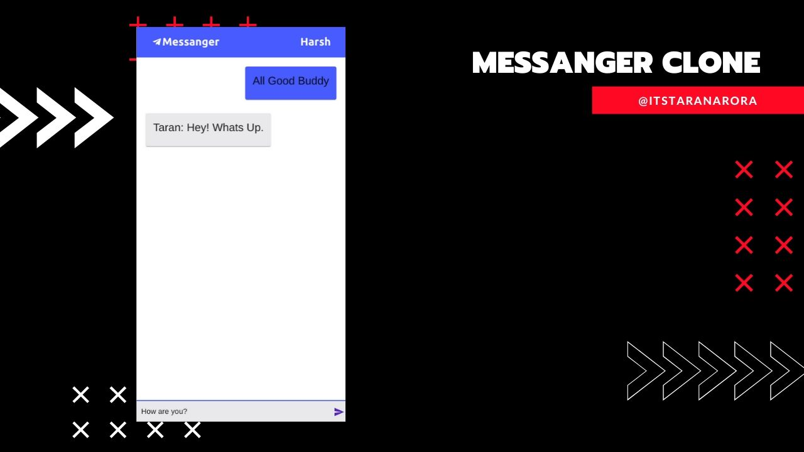

# Stangers chat

This is a Real-time chat app which allow people to chat with each other without revealing identity.

Check out the live demo: https://massanger-clone.web.app/

This app is build using React and Firebase Database Services. This app make use of firebase onSnapshot function in order to send or receive data in Real-time.

## How to run the project?

1. Clone this repository in your local system.
2. Open the command prompt from your project directory and run the command `npm install && npm start`.
3. Go to your browser and type `http://127.0.0.1:3000/` in the address bar.
4. Hurray! That's it.

**Note: You Need to setup your own firebase database in order to run this app locally.**
